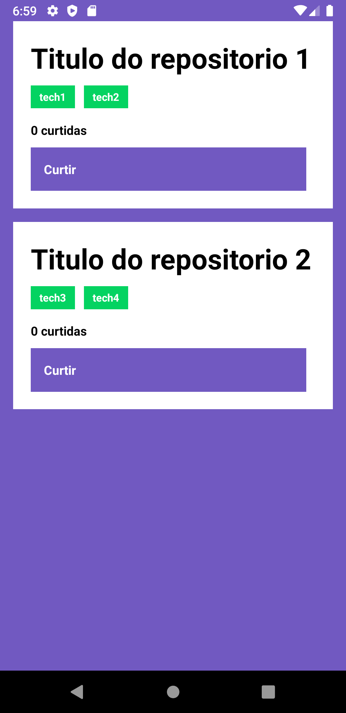
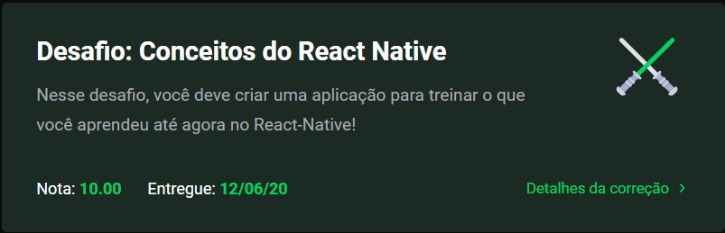
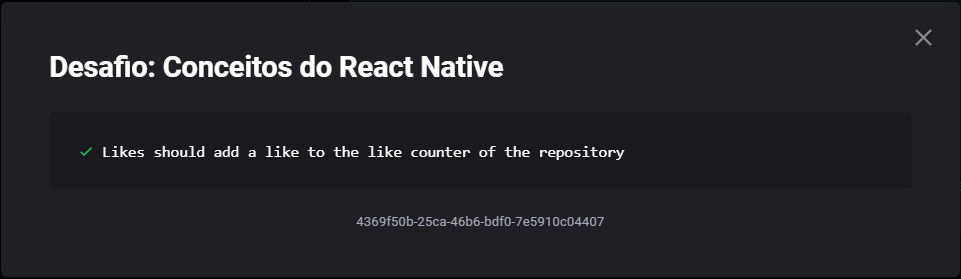

<h3 align="center">
  Clone da Solução do Desafio 04: Conceitos do React Native
</h3>

"O repositório utilizado para desenvolvimento desse desafio pode ser acessado através do
<a target="_blank" href="https://github.com/antonioaads/Learning/tree/master/bootcamp/nivel1/desafio-mobile">link</a>, este repositório foi
criado apenas para submissão no SkyLab"
!</blockquote>

  

  

  

  <a target="_blank" href="https://github.com/Rocketseat/bootcamp-gostack-desafios/tree/master/desafio-conceitos-react-native">Enunciado</a>

## Resultado

### Correção

### Detalhes da Correção

